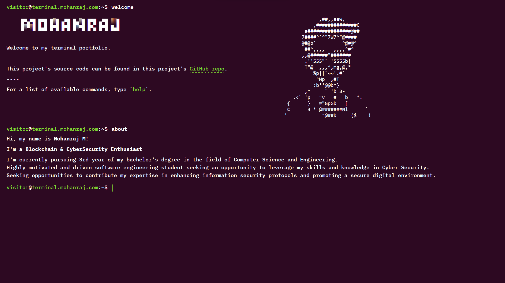

# Terminal Portfolio Website by Mohanraj

## Features

- Responsive Design 📱💻
- Multiple themes 🎨
- Autocomplete feature ✨ (TAB | Ctrl + i)
- Go previous and next command ⬆️⬇️
- View command history 📖
- PWA and Offline Support 🔥
- Well-tested ✅

## Tech Stack

**Frontend** - [React](https://reactjs.org/), [TypeScript](https://www.typescriptlang.org/)  
**Styling** - [Styled-Components](https://styled-components.com/)  
**UI/UX** - [Figma](https://figma.com/)  
**State Management** - [ContextAPI](https://reactjs.org/docs/context.html)  
**Testing** - [Vitest](https://vitest.dev/), [React Testing Library](https://testing-library.com/)  
**Deployment** - [Netlify](https://app.netlify.com/)

## Multiple Themes

Currently, this website supports 6 themes. Type `themes` in the terminal for more info.

## Web Page of Terminal Portfolio

## Inspiration and Credits

Here are some inspiration for this kind of terminal website. Only some features and functionalities are inspired by these following websites. All codes are written on my own.

- [term m4tt72](https://term.m4tt72.com/)
- [Forrest](https://fkcodes.com/)

## Author

- [@Mohanraj](https://github.com/mohanrajmdev)
